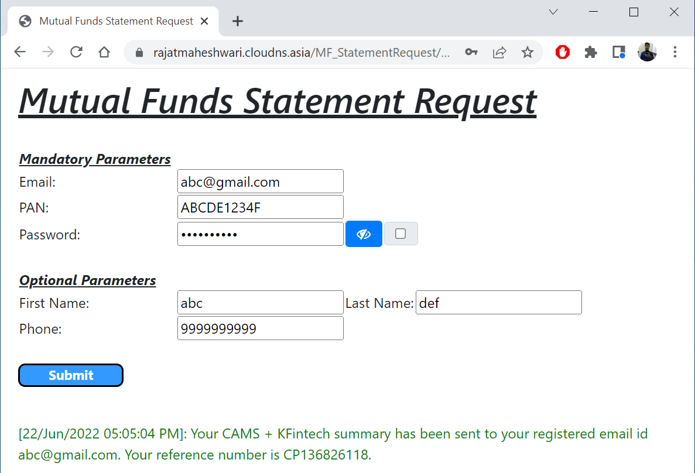

# Mutual Funds Statement Tracker
To automatically request mutual funds statement from RTA's website and send mail to aggregators (eg. Paytm Money, Groww, Piggy, IndMoney, Fisdom etc.), on a user defined frequency

_Platforms Supported_: Web - Google Chrome, We might enhance support for other browsers.

<ins>***Process***</ins>:
1. Open https://www.camsonline.com/Investors/Statements/Consolidated-Account-Statement
2. Fill up details: Statement Type, Period (Start date), With Zero balance folios, Email, PAN, Password. Submit details.
3. Get mail access rights (read and send). Read mails - Filter out mails with Subject "Consolidated Account Statement - CAMS Mailback Request". Pick latest mail (of same date or previous day).
4. Send to MF aggregators (eg. Paytm, Groww, Piggy, Fisdom etc.).

<ins>***User Inputs***</ins>:

_Mandatory_:
1. PAN
2. Email
3. Password (default as PAN)
4. Email account - should match email in details. Error handling: account access and mismatch.

_Optional_:
1. Phone
2. First Name
3. Last Name

_In **App.Config**_: (Highly Recommended not to update these settings)
1. Frequency of sync (default: weekly). Scheduled Timings.
2. URL (default: https://www.camsonline.com/Investors/Statements/Consolidated-Account-Statement)
3. Subject to search on mail (default: "Consolidated Account Statement - CAMS Mailback Request"). Retry count (default: 5) and time (default: 10 min) for searching and sending mail.
4. List of Aggregator IDs (eg. upload@piggy.co.in)

### <ins>***Application Demo***</ins>:
1. Web App Inputs-

2. CAMS Website-
